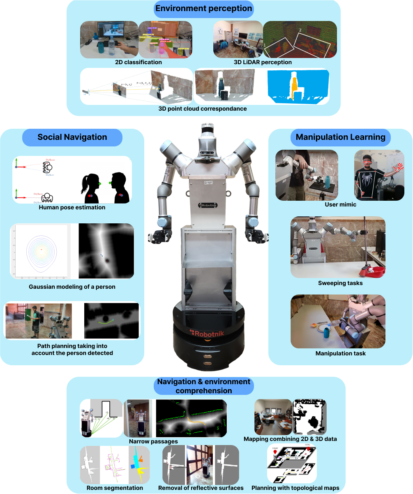

# ADAM (Ambidextrous Domestic Autonomous Manipulator)

ADAM is a robot designed to perform everyday tasks for people who have difficulties carrying out such tasks. To achieve this, ADAM is equipped with various sensors and actuators that allow it to understand its surroundings and interact with them, giving it direct utility in the actions it can perform. For these processes, ADAM aims to be a development and coordination platform between different modules that enable its use in novel environments. The main research areas with ADAM are:

[**Navigation**](../Navigation/demo.md): ADAM is capable of moving autonomously in indoor environments, avoiding obstacles and reaching the desired location. The main lines of research are:

- Localiziation: ADAM is equipped with sensors that allow it to know its position in the environment.

- Base movement: ADAM is capable of navigate through different environments using information from various levels of abstraction, such as geometric information, topological information, and semantic information.

[**Vision**](../Vision/demo.md): ADAM is equipped with cameras and LIDAR sensors that allow it to perceive its surroundings and interact with them.

- Environment Detection: ADAM is equipped with vision algorithms based on CNN (Convolutional Neural Networks) that allow it to detect different classes of objects for real-time tracking.

- Synthetic Image Generation: ADAM has been endowed with an "imagination" capability that enables it to create new scenes without user interference.

[**Manipulation**](../Manipulation/fml.md): ADAM has two robotic arms that allows it to interact with objects in its environment.

- [Learning for Manipulation](../Manipulation/gmm.md): ADAM utilizes various Learning from Demonstration (LfD) algorithms that allow it to learn directly from human information to solve everyday tasks. For this purpose, various algorithms based on different LfD techniques have been developed to directly deploy on the ADAM robot and learn to perform manipulation tasks using human information.

- [Human Tracking Algorithms]((../Manipulation/datacq.md)): ADAM is equipped with a human tracking algorithm that enables it to follow human movements and adjust its own movements in the most optimal way possible. It also has other algorithms that enable it to autonomously learn to break down complex tasks into simpler ones.

[**Grasping**](../Grasping/GraspOver.md): ADAM has a gripper and a robotic hand that allows it to grasp objects and manipulate them.

- Manipulator Claws: ADAM has two custom-developed claws designed for gripping processes, equipped with a graphical interface and force feedback sensors.

- Optimal Grasping Algorithms: Currently, optimal grasping algorithms are being developed for ADAM, taking into account the shape and pose of the object to be grasped. For this process, various types of algorithms and techniques have been developed, based on classical optimization processes as well as learning techniques.

[**Simulation**](../Simulation/ADAMSim.md) ADAM is equipped with a simulation environment that allows it to test its algorithms in a virtual environment before deploying them in the real world.

- [Domestic Environment Simulation](../Simulation/Indoor.md): ADAM has been implemented in CoppeliaSim for tasks requiring the simulation of domestic environments for synthetic dataset generation or indoor navigation testing.  
- [PyBullet Simulator](../Simulation/ADAMSim.md): A Bullet-based simulator is being developed to realistically simulate the ADAM robot and establish a connection with the physical robot.

[**Hardware developments**](../Hardware/demo.md) ADAM has various modifications in its design to add functionalities as well as additional hardware components that enhance its performance.

### *Versions of ADAM*
* [ADAM v1.0](ADAM_v1.0.md): Our first aproximation, used until September 2024. The robot in which the first algorithms and tests were made.
* [ADAM v2.0](ADAM_v2.0.md): New adaptation developed to solve some design issues and to improve the robot's capabilities. Model used from September 2024 onwards.

### *Projects developed with ADAM*
- HEROITEA: Heterogeneous IntelligentMulti-Robot Team for Assistance of Elderly People (RTI2018- 095599-B-C21), funded by Spanish Min-isterio de Economia y Competitividad 

- RoboCity2030-DIH-CM, Madrid Robotics Digital InnovationHub, S2018/NMT-4331, funded by “Programas de Actividades I+D en la Comunidad de Madrid” and co-funded by Structural Funds of the EU.

- Advanced Mobile dual arm manipulator for Elderly People Attendance (AMME) (PID2022-139227OB-I00) by Ministerio de Ciencia e Innovación, and by the National Science Foundation (FRR-2237463).

 

