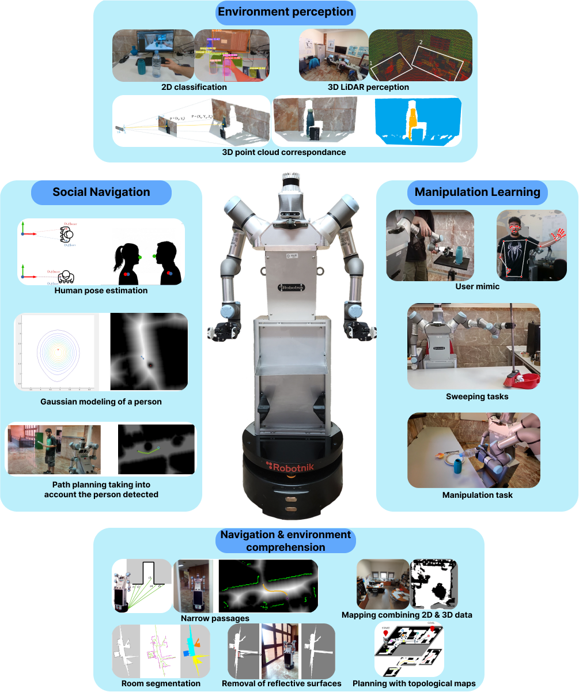

# ADAM (Ambidextrous Domestic Autonomous Manipulator)

ADAM is a robot designed to perform everyday tasks for people who have difficulties carrying out such tasks. To achieve this, ADAM is equipped with various sensors and actuators that allow it to understand its surroundings and interact with them, giving it direct utility in the actions it can perform. For these processes, ADAM aims to be a development and coordination platform between different modules that enable its use in novel environments. The main research areas with ADAM are:

[**Navigation**](../Navigation/demo.md): ADAM is capable of moving autonomously in indoor environments, avoiding obstacles and reaching the desired location. The main lines of research are:
- Localiziation: ADAM is equipped with sensors that allow it to know its position in the environment.

[**Vision**](../Vision/demo.md): ADAM is equipped with cameras and LIDAR sensors that allow it to perceive its surroundings and interact with them.

[**Manipulation**](../Manipulation/demo.md): ADAM has two robotic arms that allows it to interact with objects in its environment.

[**Grasping**](../Grasping/demo.md): ADAM has a gripper that allows it to grasp objects and manipulate them.

**Simulation** ADAM is equipped with a simulation environment that allows it to test its algorithms in a virtual environment before deploying them in the real world.

### *Versions of ADAM*
* [ADAM v1.0](ADAM_v1.0.md): Our first aproximation, used until September 2024. The robot in which the first algorithms and tests were made.
* [ADAM v2.0](ADAM_v2.0.md): New adaptation developed to solve some design issues and to improve the robot's capabilities. Model used from September 2024 onwards.

### *Projects developed with ADAM*
- HEROITEA: Heterogeneous IntelligentMulti-Robot Team for Assistance of Elderly People (RTI2018- 095599-B-C21), funded by Spanish Min-isterio de Economia y Competitividad 

- RoboCity2030-DIH-CM, Madrid Robotics Digital InnovationHub, S2018/NMT-4331, funded by “Programas de Actividades I+D en la Comunidad de Madrid” and co-funded by Structural Funds of the EU.

- Advanced Mobile dual arm manipulator for Elderly People Attendance (AMME) (PID2022-139227OB-I00) by Ministerio de Ciencia e Innovación, and by the National Science Foundation (FRR-2237463).

 

