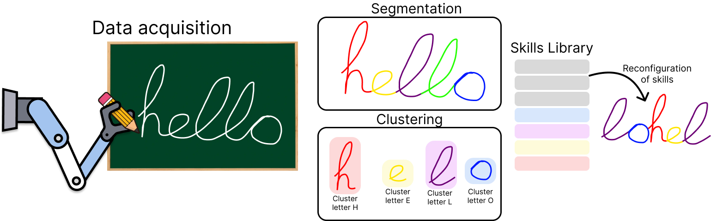

# Data Acquisition Methods

In order to carry out the learning from demonstrations process, it is necessary to have processes that are able to collect data directly from the user. With this data, the necessary learning processes can be carried out to apply to manipulation tasks with our robotic platform ADAM. In the following, we present the work focused on the field of data acquisition for the training of the different algorithms created in our laboratory.

## [TAICHI (Tracking Algorithm for Imitation of Complex Human Inputs)](https://github.com/AdrianPrados/TAICHI)

This project presents the TAICHI algorithm. This algorithm is focused on the tracking of people to collect data for the Imitation Learning technique. TAICHI is composed of a detection of the significant points of the human arm and its extraction and mapping to the robot, a Gaussian filtering process to smooth the movements and filter the sensor noise and an optimization algorithm that seeks to obtain through the inverse kinematics of the model the configuration that is closest to the human one and that does not generate collisions with its environment or with itself. The algorithm follows the following workflow:

The method allows data to be taken on the simulated ADAM model and subsequently evaluated on the real robot. The algorithm can be used with a single RGBD camera and by users of different ages and builds. The algorithm has been tested with a variety of users and has shown good results in the tracking of the human arm and the generation of trajectories that can be used for imitation learning.

### Papers and Publications
- [TAICHI: Tracking Algorithm for Imitation of Complex Human Inputs](https://ieeexplore.ieee.org/abstract/document/10256343)

- [Visual human tracking applied to non-anthropomorphic manipulators for imitation](https://ruc.udc.es/dspace/handle/2183/33668)

## [Creation of Movement Primitives Libraries for LfD](https://github.com/AdrianPrados/Segmentation-and-Grouping-Model/tree/main)
Motion primitives are a highly useful and widely employed tool in the field of Learning from Demonstration (LfD). However, obtaining a large number of motion primitives can be a tedious process, as they typically need to be generated individually for each task to be learned. To address this challenge, this work presents an algorithm for acquiring robotic skills through automatic and unsupervised segmentation. The algorithm divides tasks into simpler subtasks and generates motion primitive libraries that group common subtasks for use in subsequent learning processes. Our algorithm is based on an initial segmentation step using a heuristic method, followed by probabilistic clustering with Gaussian Mixture Models. Once the segments are obtained, they are grouped using Gaussian Optimal Transport on the Gaussian Processes (GPs) of each segment group, comparing their similarity through the energy cost of transforming one GP into another. This process requires no prior knowledge, is entirely autonomous, and supports multimodal information. The algorithm enables the generation of trajectories suitable for robotic tasks, establishing simple primitives that encapsulate the structure of the movements to be performed. Its effectiveness has been validated in manipulation tasks with a real robot, as well as through comparisons with state-of-the-art algorithms.

To perform the segmentation process, the algorithm relies on an initial heuristic approach followed by a probabilistic approximation. First, since heuristic methods tend to over-segment trajectories, we use this approach to generate initial segments. The connection points of these segments are then used as initialization points for the Gaussian Mixture Model, which re-connect the segments based on their probabilistic weights across all segments. For the clustering process, the algorithm utilizes a similarity cost between the generated segments. A Gaussian Process is employed to establish the relationship between each segment. To evaluate the cost, a Gaussian Optimal Transport (GOT) process is used to assess the cost of transforming one segment into another. The lower the transformation cost, the more similar the segments are. Consequently, if the similarity exceeds a certain threshold, the segments are considered similar. A visual example is presented below, where the same color represents the same movement library.

