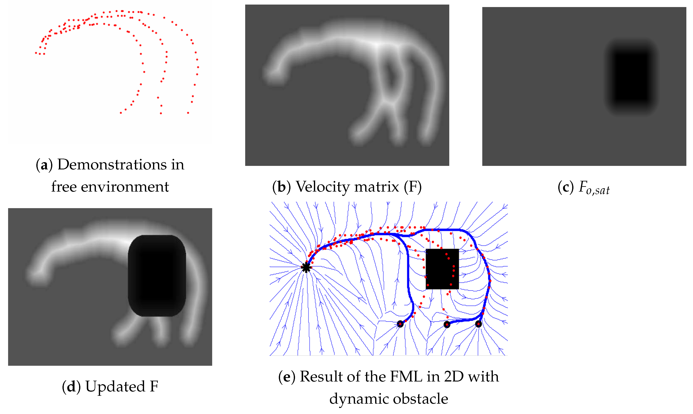
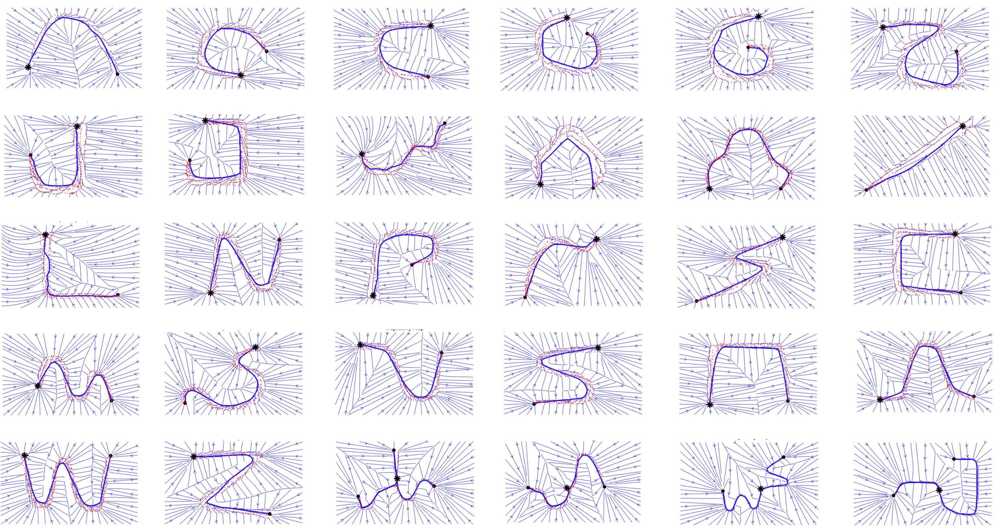
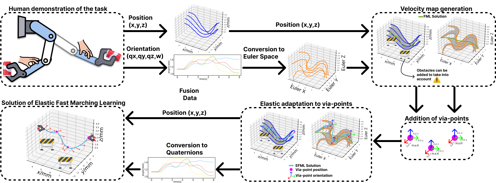
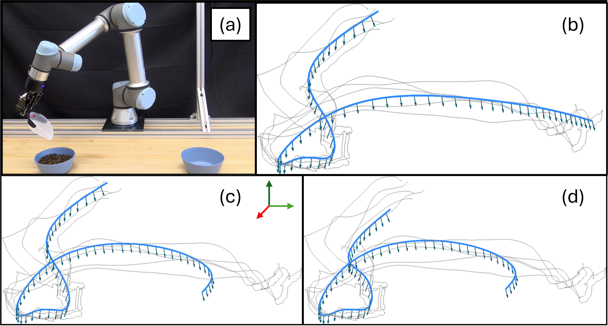

# Fast Marching Learning Methods

To perform manipulation processes of environmental elements, different methods of Learning from Demonstration based on the ideas of Fast Marching have been developed. To achieve this, the generated algorithms are capable of utilizing velocity matrices to create a navigable environment through a series of initial demonstrations, which allow the algorithm to generate viable solutions for the execution of the manipulation tasks in question.

## [Fast Marching Learning](https://www.mdpi.com/2076-3417/13/4/2028)

This algorithm combines kinesthetic teaching with the Fast Marching method to enable robots to learn manipulation tasks effectively. This approach allows robots to autonomously learn how to execute tasks based on human demonstrations, and it is particularly useful for complex manipulation scenarios where the robot must navigate and manipulate objects in dynamic environments. The process begins with the human demonstrator guiding the robot through the desired task. This kinesthetic teaching phase allows the robot to learn from the movements of the demonstrator, who physically moves the robot’s arm along the desired path. These movements are captured as trajectories, which represent the way the robot should move in order to accomplish the task. The robot learns to replicate the demonstrated task through these trajectories, and these serve as the foundational input for the learning algorithm. Once the initial demonstrations are recorded, the algorithm employs the Fast Marching Square (FMS) method. The FMS method is a numerical approach commonly used in robotics to find the optimal path through an environment. It works by solving the Eikonal equation over a grid, where each point on the grid has a value associated with it. The Fast Marching algorithm propagates values from the source (the initial demonstrations) through the grid, generating a map that indicates the shortest paths to other points in the environment. This method is particularly suited for manipulation tasks as it helps the robot navigate through complex, obstacle-filled environments while maintaining efficiency and accuracy.

The robot uses the data from the FMS method to generate a navigable environment. It learns to understand the underlying dynamics of the task by analyzing the grid values and optimizing the movement paths based on the initial demonstrations. The Fast Marching method enables the robot to calculate the optimal path to follow in order to successfully complete the task, taking into account the positions of obstacles and the required movements to manipulate objects. A critical innovation in this algorithm is the auto-learning functionality, which allows the robot to explore unknown states of the environment. This exploration is essential for ensuring that the robot can adapt to dynamic and changing conditions. As the robot learns from the initial demonstrations, it begins to generalize its knowledge, enabling it to handle variations in the task environment. This exploration feature expands the robot’s capacity to perform tasks beyond the scope of the initial demonstrations, ensuring that it can autonomously tackle new, unforeseen scenarios.

### Papers and Publications
- [Kinesthetic Learning Based on Fast Marching Square Method for Manipulation](https://www.mdpi.com/2076-3417/13/4/2028)

## Elastic Fast Marching Learning

In this algorithm, we present the code for a novel method for learning skills from human demonstrations. Our method, ___Elastic Fast Marching Learning (EFML)___, combines ideas from [Elastic Maps](https://github.com/brenhertel/ElMapTrajectories)--a Learning from Demonstration (LfD) method based on a mesh of springs--and [Fast Marching Learning](https://github.com/AdrianPrados/FastMarchingLearning)--an LfD method based on velocity fields. The integration of these methods, inspired by real-world physical phenomena, allows a robot to generate reproductions with many desirable properties. These properties include the ability to be trained with a single or multiple demonstrations, adapting to any number of initial, final, or via-point constraints, and generating smooth reproductions. Additionally, we show that our integration works in both orientation space and task space, which has previously been unexplored by either method. The proposed algorithm displays advantages in terms of precision, smoothness, and speed.

The combination of both methods allows us to perform task learning while considering limitations in Cartesian space and also adding constraints for orientations within that space. This enables us to include mandatory waypoints, such as via-points, and also take into account the obstacles in the environment, which are characterized as areas of zero velocity, where the robot cannot generate a possible solution.

