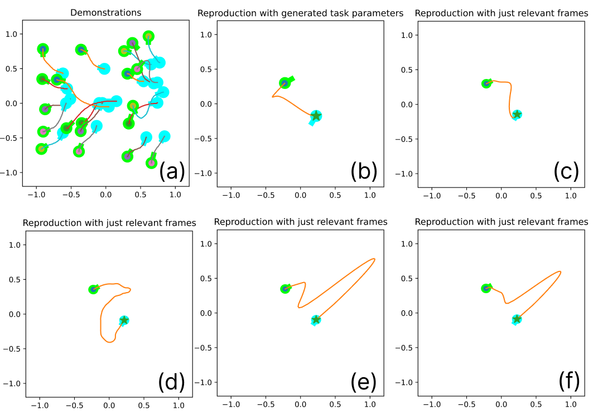
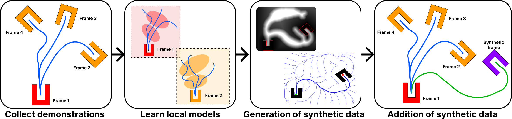
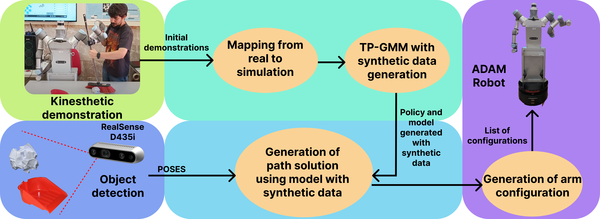
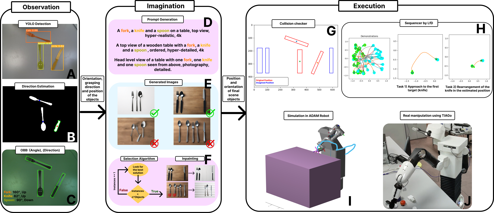

# Gaussian Mixture Models Methods

Gaussian Mixture Models (GMMs) are widely used in LfD to enable robots to learn complex manipulation tasks from human demonstrations. GMMs provide a probabilistic framework to model the demonstrated trajectories or motion patterns by capturing their underlying structure as a mixture of Gaussian distributions. This flexibility allows the representation of variability and uncertainty in the demonstrations, which is essential for adapting learned behaviors to new situations. When applied to robotic manipulators, GMMs can model multi-dimensional motion trajectories, encompassing both spatial and temporal characteristics. By combining GMMs with algorithms like Gaussian Mixture Regression (GMR), the learned motion can be generalized to new scenarios, enabling robots to replicate human-like movements while maintaining precision and adaptability. This approach has been successfully applied in tasks such as pick-and-place operations, assembly, and tool use, where the ability to encode and reproduce complex motions is crucial.

## [f-Divergence Optimization for Task-Parameterized Learning](https://ieeexplore.ieee.org/abstract/document/10535920)

In this project, we present a demonstration-based learning algorithm based on TPGMM and optimization through the use of an f-Divergence model (specifically, we will use the Kullback-Leibler). This algorithm features a detector for irrelevant frames to generalize a learned policy for tasks not demonstrated by users. The algorithm relies on detecting redundant and irrelevant frames and filtering them out. To achieve this, the algorithm iteratively obtains the probabilistic values of an initial solution considering all frames as relevant. Based on these values, it autonomously iterates, seeking the threshold that optimizes the solution by searching for the solution of minimum energy.

This algorithm, therefore, allows selecting the most important data to generate a viable solution, discarding the excess data that cannot produce the required solution for a specific task. This enables the collection of a large amount of diverse data within the same workspace, with the algorithm itself choosing those that yield a more efficient solution, eliminating the need to manually select which data to use in each learning process.

### Papers and Publications
- [f-Divergence Optimization for Task-Parameterized Learning from Demonstrations Algorithm](https://ieeexplore.ieee.org/abstract/document/10535920)

## [Learning and generalization of task-parameterized skills through few human demonstrations](https://www.sciencedirect.com/science/article/pii/S0952197624004688)

In this paper, we introduce a groundbreaking concept that enriches the original training dataset with synthetic data, thereby enabling significant improvements in policy learning. Consequently, this novel approach empowers the acquisition of task-parameterized skills with a limited number of demonstrations, paving the way for enhanced practicality. The final result of this work is to present a real application in the field of aid to dependent persons. For this purpose, tests have been carried out for the task of sweeping an area by our manipulator robot ADAM, through a few demonstrations captured by a human demonstrator.

This algorithm, therefore, allows us to learn complex tasks with minimal demonstration data, thus overcoming one of the limitations of GMMs. With the developed algorithm, we can generate synthetic solutions based on the limited initial information. These data are at least as effective as those provided by the user.

### Papers and Publications
- [Learning and generalization of task-parameterized skills through few human demonstrations](https://www.sciencedirect.com/science/article/pii/S0952197624004688)

- [Learning from demonstration through synthetic data for parameterized tasks](https://revistas.udc.gal/index.php/JA_CEA/article/view/10781)

## [Reorganization of elements in cluttered environments](https://ieeexplore.ieee.org/abstract/document/10583854)

The rearrangement of objects is an essential task in daily human life. Subconsciously, humans break down such tasks into three components: perception, reasoning, and execution, which are automatically resolved. This process represents a significant challenge for robots, as it must apply complex logic to treat all the information and successfully execute the task. In this research, we propose a solution to perform this task in a human-like manner. For that purpose, we developed a modular algorithm that provides the capability to observe and understand the scene, imaginate the best solution and execute it, following human-like reasoning. This is done combining a zero-shot deep learning model for perception, a zero-shot large diffusion model to provide a human-like final scene and a Learning from Demonstration algorithm for execution. To test the performance, we have made several experiments to check the correct resolution of the rearrangement task. To this end, we have checked the efficiency of the final scene generated, the correct performance of the path using human demonstrations and finally experiments with two different robots in a simulated and real environment. The results obtained prove the adaptability of our algorithm to different environments, objects and robots.

### Papers and Publications
- [Everyday Objects Rearrangement in a Human-Like Manner via Robotic Imagination and Learning From Demonstration](https://ieeexplore.ieee.org/abstract/document/10583854)