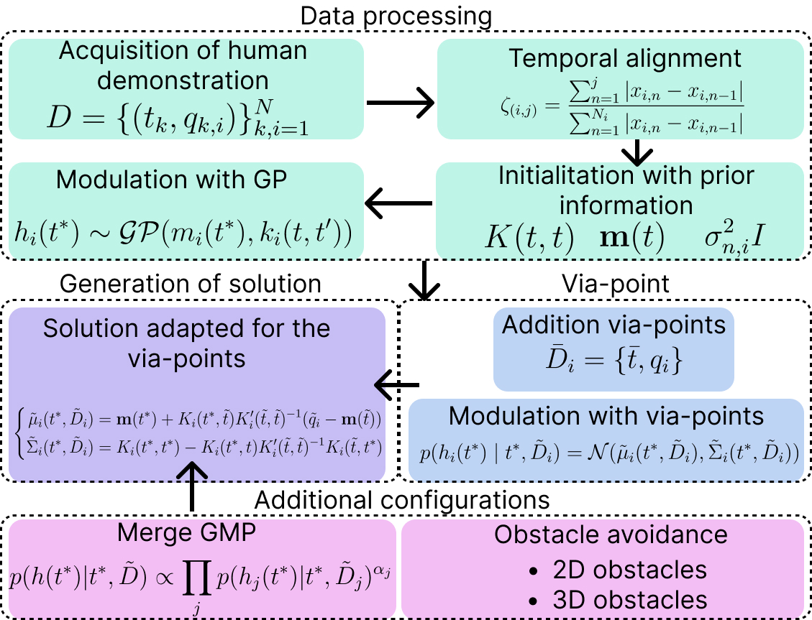
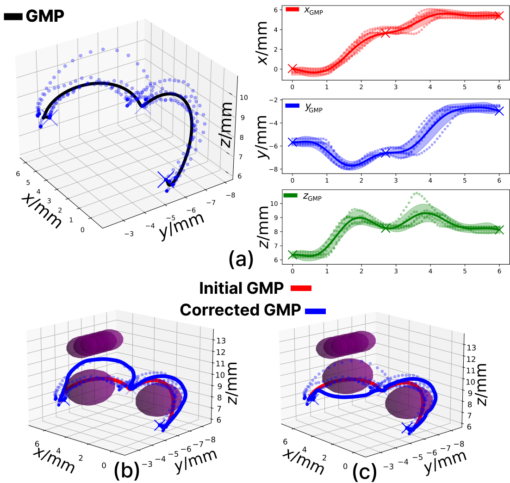

# Gaussian Process Learning Methods
Gaussian processes (GPs) have become a powerful tool in LfD for robotic manipulation due to their ability to model complex, non-linear functions in a probabilistic framework. In LfD, robots learn tasks by observing human demonstrations, and GPs provide a flexible and efficient way to capture the underlying structure of the demonstrated movements. GPs are particularly useful for modeling continuous trajectories and encoding uncertainty, which is crucial for tasks requiring precision and adaptability. By leveraging the ability of GPs to make predictions with confidence intervals, robots can generate smooth and accurate trajectories while accounting for variations in the demonstrations. This approach has been successfully applied in robotic manipulation, where GPs enable robots to generalize learned skills and adapt to new, previously unseen situations, improving performance and robustness in real-world environments.

## [Learning of Movement Primitives by Gaussian Processes from Demonstrations](https://github.com/AdrianPrados/Gaussian-Movement-Primitive)

Currently, the use of Learning from Demonstration (LfD) techniques has proven effective for encoding human skills to solve specific tasks. Among all existing techniques, the use of algorithms based on movement primitives presents an effective way to encode basic robot movements. Most of these techniques learn through parametric approaches, which increases the demands for human effort and also limits reproduction accuracy. Additionally, many LfD techniques focus on working in static environments, without considering how the skill might change in the presence of obstacles in the environment. In this work, we present a non-parametric movement primitive generation algorithm based on the use of Gaussian Processes (GP), called Gaussian Movement Primitive (GMP). Unlike other techniques, our algorithm has a sufficient condition to ensure that the generated trajectory can pass through the desired points with 100% probability, as well as the ability to be combined analytically and to avoid obstacles that may appear in the environment. To verify its efficiency, comparisons have been made in simulations on the LASA and RAIL datasets against other state-of-the-art algorithms to show the advantages of the presented algorithm, as well as experiments in real environments with a robotic arm. The developed method allows working both in the *N-dimensional joint space* and in the *Cartesian space*.

Our new method for non-parametric movement primitive learning based on Gaussian Processes, is called Gaussian Movement Primitives (GMP). The method combines some of the previously presented ideas on movement primitive learning through the use of GPs~\cite{jin2023gaussian,arduengo2023gaussian} and adds the capability to consider dynamic elements of the environment, such as obstacles. Additionally, the proposed algorithm employs a temporal alignment process that allows it to work with demonstrations at different speeds. The algorithm is also equipped with an initial processing of the demonstrations that not only avoids the manual selection of hyperparameters but also adjusts its uncertainty to the specific demonstrations of each task, a factor that is highly relevant for achieving optimal results. With all these characteristics, the algorithm can generate satisfactory task reproductions, adapt to dynamic environments, and operate efficiently in N-dimensional environments,features that the algorithms presented in this work do not possess. The next figure present the solution of the algortihm using 3D data in Cartesian space. Can be seen how the algorithm takes into account obstacles of the environment and generates a trajectory that avoids them.

