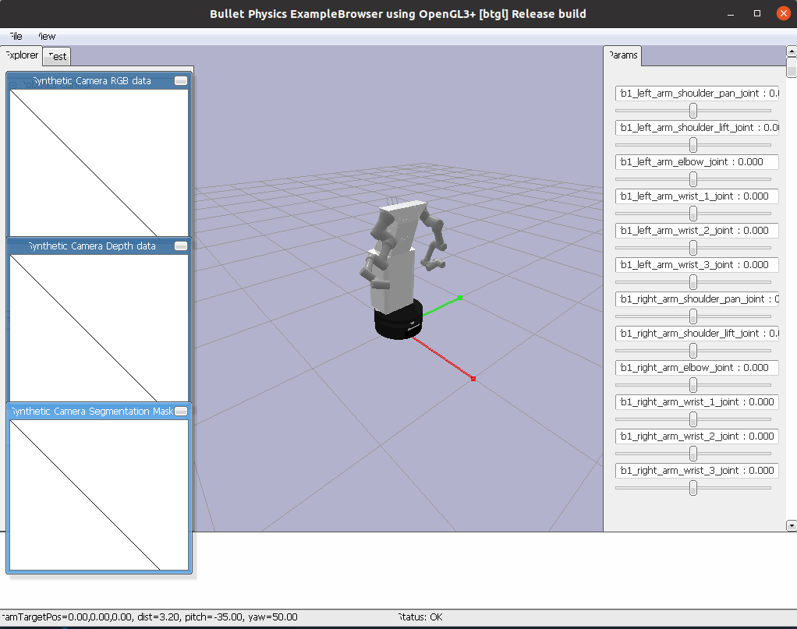

# ADAM SIMULATOR

ADAM is equipped with a simulation environment that allows it to test its algorithms in a virtual environment before deploying them in the real world. This section details the proposed method to generate random domestic environments in the [PyBullet simulator](https://pybullet.org/wordpress/). The objective is to generate environments where we can tests our algorithms and check whether the simulated models are valid for use in the real robot.

These simulator is still in development, but it is intended to be a realistic simulation of the ADAM robot and establish a connection with the physical robot.

New information will be added in a near future.