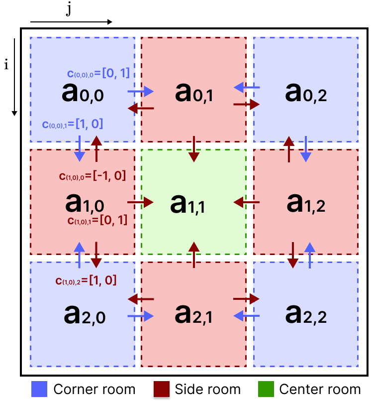
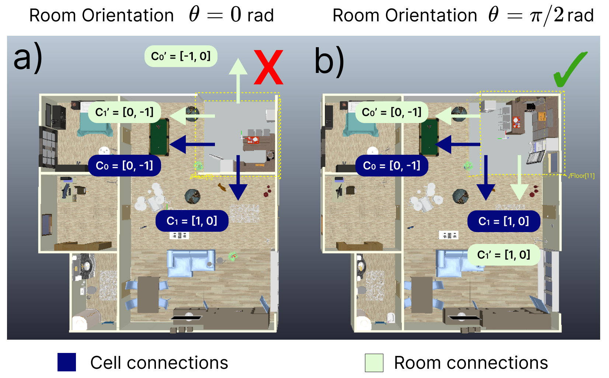
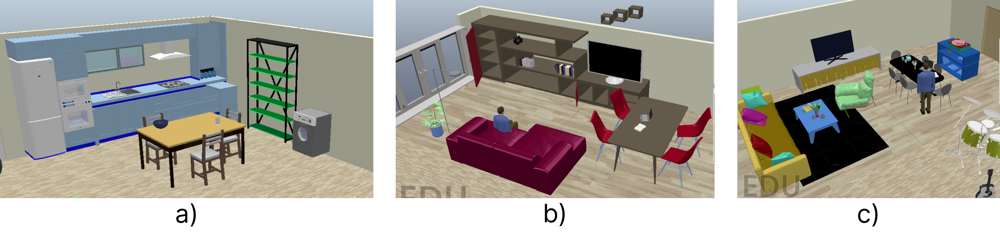
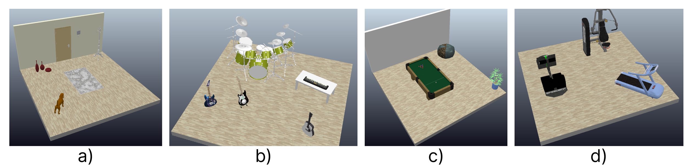
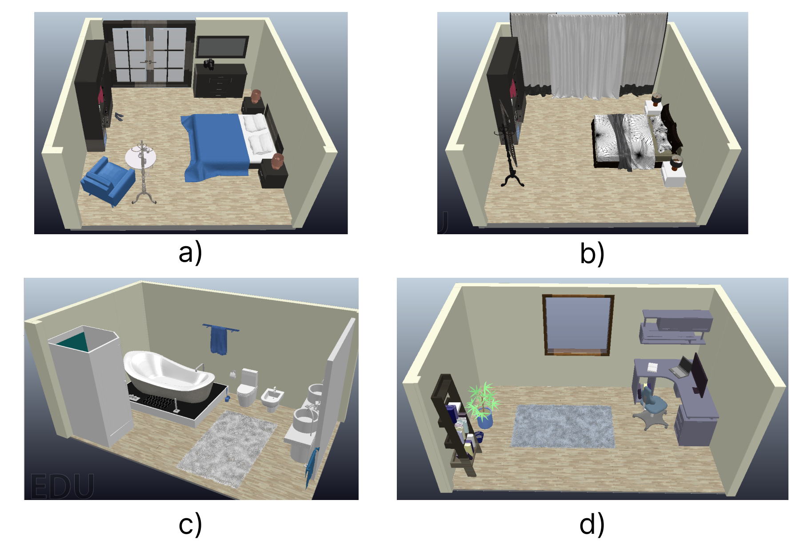

# SIMULATION

A simulation of domestic environments has been developed in order to have a digital model that allows the development of the different algorithms. In addition, it is also intended to acquire data from the environment to retrain neural networks and check whether the simulated models are valid for use in the real robot. 

***

## SIMULATORS

The options available in terms of commercial simulators are very varied. Technological advances and constant change in the field mean that new simulators are appearing, while others are becoming obsolete. There is no guide that facilitates the selection of a suitable simulation tool for the specific needs of each researcher. Some of the most prominent simulators in the field of robotics are presented below, detailing their characteristics:
|**SIMULATOR**|**CHRONOS**|**COPPELIASIM**|**GAZEBO**|**ISAAC**|**UNITY**|**WEBOTS**|
|-------------------|----------------|------|------------|--------|-------|-------|
|GPS|V|V|V|V|V|V|
|LIDAR|V|V|V|V|V|V|
|TRACKS|V|V|V|V|V|V|
|WHEELS|V|V|V|V|V|V|
|OMNI WHEELS|V|V|V|V|V|V|
|HEIGHTMAP IMPORT|V|V|V|V|V|V|
|OPENDRIVE|X|X|X|X|X|V|
|OPENSTREETMAP|X|X|X|X|X|V|
|PATHPLANNING|X|V|V|V|X|V|
|ROS SUPPORT|X|V|V|V|X|V|
|RGBD|V|V|V|V|V|V|
|REALISTIC RENDERING|V|V|X|V|V|X|

## METHODOLOGY

This section details the proposed method to generate random domestic environments in the CoppeliaSim simulator. The objective is to generate environment containing realistic household elements ensuring a logical room distribution, and where a robot, in our case the ADAM, can be introduced to operate and perform different applications. 

### GENERATION OF RANDOM DOMESTIC ENVIRONMENTS
The domestic environment is modeled as a 3x3 matrix $A$ divided into cells $(a_{i,j})$ for i,j = 0,1,2 which correspond to a certain area. This ensures a regular house plan that can allocate diverse essential room types (such as kitchens or bathrooms) and wide open spaces. Both the orientation and position of a room must be indicated when generating a room in the simulator. Rooms, and specially the outermost ones divided into \textit{corner rooms} (in contact with two rooms, N=2), \textit{side rooms} (in contact with three rooms, N=3) and \textit{center room} (in contact with four rooms, N=4), must be correctly oriented to avoid placing doors that coincide with external or internal walls. For each cell $a_{i,j}$ we define a set of \textit{connection vectors} $C_{i,j} = [c_{(i,j),0},..., c_{(i,j),N-1}]$, where each \textit{connection} $c_{(i,j),k}$ where $k=0,...,N$, points to the location of an adjacent room. Then, each room model must be rotated to the orientation $\theta_{i,j}$ for which the room's connections $C'_{i,j}$ are aligned with cell connections $C_{i,j}$ of their assigned location. This means that in their proper orientation, the room's connections point to existing rooms, not out of bounds.

This process is divided in two steps:

* **Random selection of room:** The first part of the method consists on the random selection of room models for each type of room. To generate our environments, each type of room is generated once. Table~\ref{tab:room_types} shows the different room types with their default \textit{connection} vectors to adjacent rooms at $\theta_{i,j} = 0$. Note that type 4 rooms that correspond to living room models are described as large rooms. This type of room occupies two adjacent areas (cells) in any orientation, i.e., $(a_{i,j},a_{i+1,j})$ or $(a_{i,j},a_{i,j+1})$. Type 5 room models are designated to be the center area with fixed position $a_{1,1}$.

|**TYPE**|**DESCRIPTION**|**CONNECTIONS AT $\theta_{i,j}=0$**|
|-------------------|----------------|------|
|0|Hall (Side) |[[0, -1],[-1, 0],[0,1]]|
|1|Kitchen (Corner) |[[0, -1],[-1, 0]]|
|2|Bathroom (Corner)|[[0, -1],[-1, 0]]|
|3|Free use (Side)|[[0, -1],[-1, 0],[0,1]]|
|4|Living room (Side, large)|[[0, -1],[-1, 0],[0,1]]|
|5|Center area|[[0, -1],[-1, 0],[0,1],[1,0]]|
|6|Bedroom (Corner)|[[0, -1],[-1, 0]]|
|7|Office (Side)|[[0, -1],[-1, 0],[0,1]]|

A set of $M_t$ distinct room models in CoppeliaSim are predefined for each room type $t$, so the probability of a model $m_{t,i}$ being selected for a certain type is $P(m_{t,i}|t) = \frac{1}{|M_t|}$. Figure~\ref{fig:example_rooms} shows an example of room models for side and corner rooms, oriented at $\theta = 0\;rad$ and located at the world origin. The result of this part is a set of unique room models identified by their room type $t$ initialized at default position, origin and connections.

* **Random distribution of rooms:**  The second part of the method consist in the random distribution of the rooms shown in Algorithm~\ref{alg:random_rooms}. We define a vector $T_{1 \times 8}$ where each of its elements $T_t$ contains the randomly selected room model $m_{t}$ and its corresponding connections $C'_{i,j}$ for each room type $t=0,...,7$. The elements in $T$ are randomly shuffled and assigned to empty cells in the area distribution matrix $A = (a_{i,j})_{3\times 3}$ according to their room type. It is also ensured that the room connections $C'_{i,j}$ align with their corresponding cell connections (pointing to not out of bounds existing areas) and rotated otherwise with a rotation matrix $R_z(\pi/2)$ and $\theta_{i,j} = \theta_{i,j} + \pi/2 \;rad$. Other restrictions imposed are the location of the center room in cell $a_{1,1}$ and the assignation of two adjacent cells to large rooms as previously mentioned in this Section.

Having assigned the rooms to each area cell, the models are placed and oriented in the empty scene in CoppeliaSim to which the algorithm is connected. The models are placed at the coordinates given by $a_{i,j}$ times the room length of a cell $d = 5$ m and oriented at their corresponding angle $\theta_{i,j}$ with respect to the world's reference frame.

The algorithm is not only responsible for placing the rooms in certain positions, but also for orienting them in such a way that they do not generate discontinuities or failures in the design.

### EXAMPLES OF THE ROOMS

The following are examples of individually designed rooms for the generation of a complete environment.

Several complete simulation environments have been generated where the rooms comply with the appropriate positions and orientations indicated in the matrix.

***