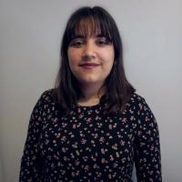
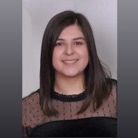

# About Us
The group is composed of various PhD candidates, master's students, and doctors who are responsible for developing the different algorithms and tasks on our robot to perform various operations in real-world environments. The group is led by the following people:

## *Group Leaders*

  
  
<strong>Ramón Barber</strong> is an Associate Professor of the System Engineering and Automation Department, at the University Carlos III of Madrid, Spain. He received the B.Sc. degree in Industrial Engineering from Polytechnic University of Madrid (1995), and the Ph. D. degree in Industrial Technologies from the University Carlos III (2000). His research topics are focused on Mobile Robotics including perception of the environment, environment modelling, planning, localization and navigation tasks, considering geometrical, topological and semantic representations. He is a member of the International Federation of Automatic Control (IFAC) and of the IEEE.

<strong>Luis Moreno</strong> is PhD in Industrial Engineering (1988) from Univ. Politecnica de Madrid. He has been Lecturer and Associate Prof at Univ. Politecnica de Madrid (1986-1994), from 1994 is Professor at Polytechnic School of Univ. Carlos III de Madrid, and from 2009 Full Professor. His main research line is Robotics. In particular he has been involved in different research projects in mobile manipulators, lightweight robots, advanced actuators, mobile robots, path planning, perception, navigation, environment modeling and exoskeletons. He has participate in more than 40 research projects with public funding (National and European) and 26 project with private funding. He is author of 4 patents, 5 books, 18 books chapters, 80 Journal papers, 160 conference papers. He has been supervisor of 28 PhD thesis. He has collaborated in the creation of 5 technological startups companies originated in its research group.

    

  
  
<strong>Luis Moreno</strong> received the degree in mathematics from the Complutense University of Madrid, in 1979, and the degree in physics and the Ph.D. degree from the Universidad Carlos III de Madrid,
Madrid, Spain, in 1955 and 2000, respectively. In 1997, he joined the Department of Systems Engineering and Automation, Universidad Carlos III de Madrid, where he has been involved in several mobile robotics projects. His research interests include mobile robotics, mobile manipulators, environment modeling, path planning, and mobile robot global localization problems.

## *PhD Students*

  
  
<strong>Alicia Mora</strong> was born in Getafe, Spain, in1998. She received the B.S. degree in IndustrialElectronics and Automation Engineering (2020)and the M.S. in Robotics and Automation (2022)at Carlos III University of Madrid. She is currently pursuing her PhD and collaborating as a researcher with Robotics Lab at University Carlos III of Madrid. Her main research topics are focused on mobile robots, including mapping considering geometric, topological and semantic representations,as well as navigation for assistive robots. 

<strong>Adrián Prados</strong> was born in Leganés, Spain, in 1999. He received the B.S. degree in Industrial Electronics and Automation Engineering (2021) and the M.S. in Robotics and Automation (2023) at University Carlos III of Madrid (UC3M). He is currently pursuing his PhD in the program of Electrical, Electronic and Automation Engineering and collaborating as a researcher with Robotics Lab at University Carlos III of Madrid. His main research topics are focused on Imitation Learning and Learning from Demonstration, including generalisation of learned task and adaptation to new environment, applied on manipulation tasks. He also works in terms related with control of mobile manipulators, deep learning, optimisation techniques and assistive robots.

    

  
  
<strong>Alberto Méndez</strong> was born in Santa Cruz de Tenerife, Spain, in 1999. He received the B.S. degree in Electronics and Automatic Engineering at University of La Laguna(ULL) in 2021 and the M.S. in Robotics and Automation at University Carlos III of Madrid (UC3M) in 2023. Currently, Alberto Mendez is a PhD candidate in the program of Electrical, Electronic and Automation Engineering at UC3M. Also, he is collaborating as a researcher with RoboticsLab at University Carlos III of Madrid. His lines of research focus on computer vision and deep learning. Including topics such as the detection and localisation of elements in the environment, artificial intelligence and 3D perception.

## *Master Students*

  
  
<strong>Gonzalo Espinoza</strong> was born in Getafe, Spain, in1998. She received the B.S. degree in IndustrialElectronics and Automation Engineering (2020)and the M.S. in Robotics and Automation (2022)at Carlos III University of Madrid. She is currently pursuing her PhD and collaborating as a researcher with Robotics Lab at University Carlos III of Madrid. Her main research topics are focused on mobile robots, including mapping considering geometric, topological and semantic representations,as well as navigation for assistive robots. 

<strong>Noelia Fernandez</strong> was born in Leganés, Spain, in 1999. He received the B.S. degree in Industrial Electronics and Automation Engineering (2021) and the M.S. in Robotics and Automation (2023) at University Carlos III of Madrid (UC3M). He is currently pursuing his PhD in the program of Electrical, Electronic and Automation Engineering and collaborating as a researcher with Robotics Lab at University Carlos III of Madrid. His main research topics are focused on Imitation Learning and Learning from Demonstration, including generalisation of learned task and adaptation to new environment, applied on manipulation tasks. He also works in terms related with control of mobile manipulators, deep learning, optimisation techniques and assistive robots.

    

