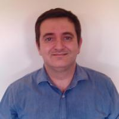

# About Us
The group is composed of various PhD candidates, master's students, and doctors who are responsible for developing the different algorithms and tasks on our robot to perform various operations in real-world environments. The group is led by the following people:

## *Group Leaders*

  
  <!-- Enlace debajo de la imagen -->
  <a href="https://scholar.google.es/citations?user=zVLybhsAAAAJ&hl=es&oi=ao" target="_blank" style="display: block; text-align: center; margin-top: 10px;">Research List</a>

<!-- Texto que estará al lado de la imagen -->

  <strong>Ramón Barber</strong> is an Associate Professor of the System Engineering and Automation Department, at the University Carlos III of Madrid, Spain. He received the B.Sc. degree in Industrial Engineering from Polytechnic University of Madrid (1995), and the Ph. D. degree in Industrial Technologies from the University Carlos III (2000). His research topics are focused on Mobile Robotics including perception of the environment, environment modelling, planning, localization and navigation tasks, considering geometrical, topological and semantic representations. He is a member of the International Federation of Automatic Control (IFAC) and of the IEEE.

<!-- Luis Moreno -->

  
  <!-- Enlace debajo de la imagen -->
  <a href="https://scholar.google.es/citations?user=FHOCQnUAAAAJ&hl=es&oi=ao" target="_blank" style="display: block; text-align: center; margin-top: 10px;">Research List</a>

  <strong>Luis Moreno</strong> is PhD in Industrial Engineering (1988) from Univ. Politecnica de Madrid. From 1994 is Professor at University Carlos III of Madrid, and from 2009 Full Professor. His main research line is Robotics. He has been involved in different research projects in mobile manipulators, lightweight robots, advanced actuators, mobile robots, path planning, perception, navigation, environment modeling and exoskeletons. He has participated in more than 40 research projects with public funding and 26 projects with private funding. He is author of 4 patents, 5 books, 18 book chapters, 80 Journal papers, and 160 conference papers. He has been supervisor of 28 PhD theses.

<!-- Santiago Garrido -->

  
  <a href="https://scholar.google.es/citations?user=o9ceby4AAAAJ&hl=es&oi=ao" target="_blank" style="display: block; text-align: center; margin-top: 10px;">Research List</a>

  <strong>Santiago Garrido</strong> received the degree in mathematics from the Complutense University of Madrid, in 1979, and the degree in physics and the Ph.D. degree from the Universidad Carlos III de Madrid, Madrid, Spain, in 1955 and 2000, respectively. In 1997, he joined the Department of Systems Engineering and Automation, Universidad Carlos III de Madrid, where he has been involved in several mobile robotics projects. His research interests include mobile robotics, mobile manipulators, environment modeling, path planning, and mobile robot global localization problems.

## *Researchers*
<!-- Alicia Mora -->

  
  <a href="https://scholar.google.es/citations?user=28sMEPkAAAAJ&hl=es&oi=ao" target="_blank" style="display: block; text-align: center; margin-top: 10px;">Research List</a>

  <strong>Alicia Mora</strong> was born in Getafe, Spain, in 1998. She received the B.S. degree in Industrial Electronics and Automation Engineering (2020) and the M.S. in Robotics and Automation (2022) at Carlos III University of Madrid. She is currently pursuing her PhD and collaborating as a researcher with Robotics Lab at University Carlos III of Madrid. Her main research topics are focused on mobile robots, including mapping considering geometric, topological and semantic representations, as well as navigation for assistive robots.

<!-- Adrián Prados -->

  
  <!-- Enlace debajo de la imagen -->
  <a href="https://scholar.google.es/citations?user=A7JOZNQAAAAJ&hl=es" target="_blank" style="display: block; text-align: center; margin-top: 10px;">Research List</a>

  <strong>Adrián Prados</strong> was born in Leganés, Spain, in 1999. He received the B.S. degree in Industrial Electronics and Automation Engineering (2021) and the M.S. in Robotics and Automation (2023) at University Carlos III of Madrid (UC3M). He is currently pursuing his PhD in the program of Electrical, Electronic and Automation Engineering and collaborating as a researcher with Robotics Lab at University Carlos III of Madrid. His main research topics are focused on Imitation Learning and Learning from Demonstration, including generalization of learned tasks and adaptation to new environments, applied to manipulation tasks. He also works on control of mobile manipulators, deep learning, optimization techniques, and assistive robots.

<!-- Alberto Méndez -->

  
  <a href="https://scholar.google.es/citations?user=31Qh_d4AAAAJ&hl=es&oi=ao" target="_blank" style="display: block; text-align: center; margin-top: 10px;">Research List</a>

  <strong>Alberto Méndez</strong> was born in Santa Cruz de Tenerife, Spain, in 1999. He received the B.S. degree in Electronics and Automatic Engineering at University of La Laguna (ULL) in 2021 and the M.S. in Robotics and Automation at University Carlos III of Madrid (UC3M) in 2023. Currently, Alberto Mendez is a PhD candidate in the program of Electrical, Electronic and Automation Engineering at UC3M. Also, he is collaborating as a researcher with RoboticsLab at University Carlos III of Madrid. His lines of research focus on computer vision and deep learning. Including topics such as the detection and localisation of elements in the environment, artificial intelligence and 3D perception.

<!-- Noelia Fernández -->

  
  <!-- Enlace debajo de la imagen -->
  <a href="https://scholar.google.es/citations?user=jVrJayQAAAAJ&hl=es&oi=ao" target="_blank" style="display: block; text-align: center; margin-top: 10px;">Research List</a>

  <strong>Noelia Fernández</strong> is a Technical Industrial Engineer. She has completed the Master's Degree in Industrial Engineering and is currently finishing her studies in the Master's Degree in Robotics and Automation. She started designing and programming an autonomous terrestrial robot for interventions with firefighters from scratch. Later, she explored other fields such as manipulation with industrial robotic arms coordinated with vision systems, navigation and environment monitoring, development of indoor simulations, and training of neural networks for object detection. Currently, she is developing HRI systems integrating AI with other types of information to achieve applications to improve people's lives.

<!-- Gonzalo Espinoza -->

  
  <a href="https://scholar.google.es/citations?user=iOFuxMIAAAAJ&hl=es&oi=ao" target="_blank" style="display: block; text-align: center; margin-top: 10px;">Research List</a>

  <strong>Gonzalo Espinoza</strong> was born in Getafe, Spain, in 1998. He received the B.S. degree in Industrial Electronics and Automation Engineering (2020) and the M.S. in Robotics and Automation (2022) at Carlos III University of Madrid. She is currently pursuing her PhD and collaborating as a researcher with Robotics Lab at University Carlos III of Madrid. Her main research topics are focused on mobile robots, including mapping considering geometric, topological and semantic representations, as well as navigation for assistive robots.

